```mermaid
graph LR
    A[🌱 Learning] --> B[Go Programming]
    C[👥 Collaborating] --> D[ML Research Projects]
    E[💡 Expertise] --> F[Machine Learning]
    E --> G[Large Language Models]
    E --> H[Prompt Engineering]
    
    style A fill:#8A2BE2,stroke:#fff,color:#fff
    style C fill:#FF6B35,stroke:#fff,color:#fff
    style E fill:#6A5ACD,stroke:#fff,color:#fff
```

# 

---

##  **Professional Summary**

<table>
<tr>
<td width="60%">

**Machine Learning Engineer** with a passion for building intelligent systems that solve real-world problems. Specialized in developing scalable AI solutions, from data preprocessing to model deployment. Strong advocate for clean, maintainable code and continuous learning through the **Kaizen** philosophy.

**Core Strengths:**
- 🎯 **AI/ML Development** - End-to-end machine learning pipeline design
- 📊 **Data Engineering** - Large-scale data processing and analysis  
- 🚀 **Model Deployment** - Production-ready AI system implementation
- 🧠 **Research** - Exploring cutting-edge ML techniques and applications
- 💡 **Problem Solving** - Creative solutions for complex technical challenges

</td>
<td width="40%">

**Contact Information:**
- 📧 **Email:** njugunahdann@gmail.com
- 🐦 **Twitter:** [@c10ud_reformist](https://twitter.com/c10ud_reformist)
- 🌍 **Location:** Nairobi, Kenya 🇰🇪
- 🎵 **Currently Vibing:** Nyashinski 🎧

</td>
</tr>
</table>

---

##  **Technical Expertise**

### 🤖 **Artificial Intelligence & Machine Learning**

<table align="center">
<tr>
<td align="center">

 <b>Python</b>
</td>
<td align="center">

 <b>PyTorch</b>
</td>
<td align="center">

 <b>TensorFlow</b>
</td>
<td align="center">

 <b>Scikit-Learn</b>
</td>
<td align="center">

 <b>Pandas</b>
</td>
<td align="center">

 <b>OpenCV</b>
</td>
</tr>
</table>

### 💻 **Development & Infrastructure**

<table align="center">
<tr>
<td align="center">

 <b>Go</b>
</td>
<td align="center">

 <b>C</b>
</td>
<td align="center">

 <b>Bash</b>
</td>
<td align="center">

 <b>FastAPI</b>
</td>
<td align="center">

 <b>PostgreSQL</b>
</td>
<td align="center">

 <b>MySQL</b>
</td>
</tr>
<tr>
<td align="center">

 <b>Docker</b>
</td>
<td align="center">

 <b>Git</b>
</td>
<td align="center">

 <b>Linux</b>
</td>
<td align="center">

 <b>Google Cloud</b>
</td>
<td align="center">

 <b>AWS</b>
</td>
<td align="center">

 <b>Postman</b>
</td>
</tr>
</table>

---

##  **Current Focus & Learning**

<table align="center">
<tr>
<td align="center" width="33%">

<h4>🌱 Currently Learning</h4>

<strong>Go Programming</strong> 
Expanding backend development skills for high-performance systems

</td>
<td align="center" width="33%">

<h4>🔬 Research Interests</h4>

<strong>ML Research</strong> 
Open to collaborations on cutting-edge AI projects

</td>
<td align="center" width="33%">

<h4>💬 Ask Me About</h4>

<strong>AI/ML Solutions</strong> 
LLMs, Prompt Engineering, ML Architecture

</td>
</tr>
</table>

---

##  **Performance Metrics**

 

<table align="center">
<tr>
<td align="center">

 

 <b>Total Coding Time</b>
</td>
</tr>
</table>

---

##  **Let's Connect & Collaborate**

<table>
<tr>
<td align="center">

</td>
<td align="center">

</td>
<td align="center">

</td>
</tr>
</table>

 

**Open for:**
- 🤝 **Collaborations** on Machine Learning Research
- 💼 **Consulting** on AI/ML Projects  
- 🎤 **Speaking** at Tech Events & Conferences
- 📝 **Technical Writing** & Knowledge Sharing

---

##  **Philosophy & Values**

<table align="center" style="border: none;">
<tr>
<td align="center" width="33%" style="border: none;">

<h4>改善 Kaizen</h4>

<em>"Always improving, always evolving"</em>

</td>
<td align="center" width="33%" style="border: none;">

<h4>Empathy</h4>

<em>"The ultimate soft skill in tech and life"</em>

</td>
<td align="center" width="33%" style="border: none;">

<h4>Unity</h4>

<em>"Human dignity, diversity, and collaboration"</em>

</td>
</tr>
</table>

### 💡 Random Quote

<!-- QUOTE_START -->
> A fall into a ditch makes you wiser. — Chinese Proverb
<!-- QUOTE_END -->

---

 **Proudly Made in Kenya** 

